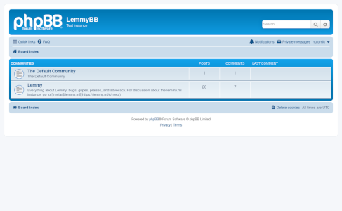

# lemmyBB

[](https://cloud.drone.io/LemmyNet/lemmyBB)

A Lemmy frontend based on [phpBB 3.3](https://www.phpbb.com/).

## Screenshots




## Instances

Here is a list of known lemmyBB instances:

| Domain                                                             | Registration | lemmy-ui domain                                                | Notes                   |
| ------------------------------------------------------------------ | ------------ | -------------------------------------------------------------- | ----------------------- |
| [lemmybb.lemmy.ml](https://lemmybb.lemmy.ml/)                      | open         | [lemmyui.lemmy.ml](https://lemmyui.lemmy.ml/)                  | developer test instance |
| [lemmybb.rollenspiel.monster](https://lemmybb.rollenspiel.monster) | open         | [lemmy.rollenspiel.monster](https://lemmy.rollenspiel.monster) | topic role play         |

Please open a pull request if you know another instance.

## Installation

Follow the [Lemmy installation instructions](https://join-lemmy.org/docs/en/administration/administration.html) to install Lemmy backend and lemmy-ui first. You will need one (sub)domain for LemmyBB, and another for lemmy-ui.

Then install lemmyBB itself. First, ssh into your server and prepare by cloning the code repository.

```
cd /opt
git clone https://github.com/LemmyNet/lemmyBB.git
```

Change to the folder and compile Lemmy.

```
cd lemmyBB
cargo build --release
```

Copy the nginx config into the sites-enabled folder and edit it

```
cp docker/nginx-lemmybb.conf /etc/nginx/sites-enabled/lemmybb.conf
```

create systemd service file

```
nano /etc/systemd/system/lemmy_bb.service
```

and insert the following content and adapt 'LEMMY_BB_BACKEND' and 'LEMMY_BB_LISTEN_ADDRESS' to your installation

```
[Unit]
Description=lemmy_bb
After=network.target

[Service]
Type=simple
WorkingDirectory=/opt/lemmyBB/
Environment="LEMMY_BB_BACKEND=http://127.0.0.1:8536"
Environment="LEMMY_BB_LISTEN_ADDRESS=127.0.0.1:8703"
Environment="LD_PRELOAD=libjemalloc.so"
ExecStart=/opt/lemmyBB/target/release/lemmy_bb
Restart=always

[Install]
WantedBy=multi-user.target
```

then activate and start the service and check the status

```
systemctl enable --now lemmy_bb.service
systemctl status lemmy_bb.service
```

### Updating

Run the following commands to update lemmyBB to the latest development version.

```
cd /opt/lemmyBB
git pull
cargo build --release
systemctl restart lemmy_bb.service
```

## Development

Execute the following command, with a Lemmy instance of your choice:
```
LEMMY_BB_BACKEND=https://lemmy.ml cargo run
```

You can also run a local development instance of Lemmy, either [native](https://join-lemmy.org/docs/en/contributing/local_development.html) or in [Docker](https://join-lemmy.org/docs/en/contributing/docker_development.html), and connect to it with:

```
LEMMY_BB_BACKEND=http://localhost:8536 cargo run
```

## Configuration

lemmyBB is configured via environment variables:

| var                     | default value         | description                                                  |
| ----------------------- | --------------------- | ------------------------------------------------------------ |
| LEMMY_BB_BACKEND        | http://localhost:8536 | Protocol, hostname and port where lemmy backend is available |
| LEMMY_BB_LISTEN_ADDRESS | 127.0.0.1:1244        | IP and port where lemmyBB listens for requests               |

## License

The project is licensed under [AGPLv3](LICENSE).

Theme files from phpBB are licensed under [GPLv2](https://www.phpbb.com/downloads/license).
